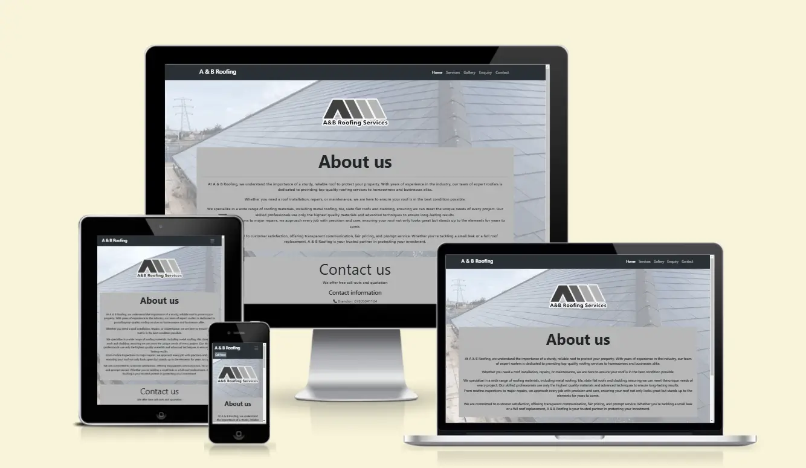
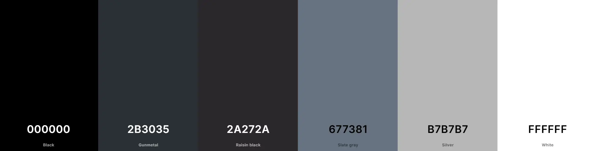

# My Milestone Project 1

## A & B Roofing Services Website
This is a real world business that is looking for a responsive and easy to use websote for customers of all ages. This website will allow users to view previous jobs and see what the company offer in their services. Customers will have the ability to send an enquiry, use the click-to-call buttons at the very top and bottom of the page and visit the company's Facebook page.

[View A & B Roofing Services' page now!](https://chloejones9464.github.io/a-and-b-roofing-services/)

## Table Of Contents:
1. [Design & Planning](#design-&-planning)
    * [User Stories](#user-stories)
    * [Wireframes](#wireframes)
    * [Typography](#typography)
    * [Colour Scheme](#colour-scheme)

    
2. [Features](#features)
    * [Navigation](#Navigation)
    * [Footer](#Footer)
    * [Home page](#Home-page)
    * [Other features](#Other-features)

3. [Technologies Used](#technologies-used)
4. [Testing](#testing)
5. [Bugs](#bugs)
6. [Deployment](#deployment)
7. [Credits](#credits)

## Design & Planning:

### Initial Discussions
A & B Roofing Services is a company in the real world that have been established since COVID came around. It is a family run business with over 30 years experience and have proven very popular and reliable in and around the Rhondda Valleys.
Customers have spread the word about A & B Roofing Services through general word of mouth but the company have been looking to create another way to reach their customers.

Along with Facebook and the local business magazine promotions, Brandon and Anthony have some concerns that these methods may not be enough. After a few customers asking and advising, the company finally decided to create their own website with easy to use features, the ability to call them on any page, access to their ever growing portfolio, a service page with all they can offer and an enquiry page.

### Key information for the site

* The company's commitment to provide the best work possible at a very reasonable price.
* Having more than one point of contact for convenient and easy user experience.
* Displaying previous work on the website that will give customers reassurance of a job well done.
* Simple design, not to overwhelm users.

### User Stories

#### User experience

* I would like the website to have a clear navigation area so that I can use get from page to page with easy.
* I would like there to be clear information on the first page I see so that I know immediately I'm visiting the correct site.
* I want the contact details to be accessible on all pages so that I can find them with just one click.
* I want to have the option to contact the company through their website so that I have more than one option to get hold of the company.
* I want to have a sign that tells me my enquiry has been sent so that I know the company has received it.

#### Company goals

* I want my website to have as much information as possible so that potential customers can see what we services we have to offer.
* I would like to include various jobs we've completed on the website so that customers can view what we can do and to the standard we're proud of.
* I want to have a Call Now button for an emergency or ease of contact so that the company can be contacted right-away.

### Wireframes
To view the wireframes for this project, please click [here](wireframes.md)
### Typography
I used Google Fonts to import fonts to use for the website.

I went with a combination on Nunito and Sans-Serif. Discussed with the company, these fonts seems very approachable, easy and friendly to the eye.
### Colour Scheme
As this is a project for an actual company, I've stuck with the color scheme given to me by their logo. Very minimalistic but effective.

## Features:
Explain your features on the website,(navigation, pages, links, forms.....)
The website has a collapsable navigation bar in the header and a contact section in the footer (more below).
Each page on the website contains the company's logo at the very top of the page, this is for the effect anf feeling of consistency throughout the site.
### Pages on the website consist of a; 
* Home page - The home page of the website contains the company's about us section where they express their dedication and commitment to deliver high quality roofing services.
* Services page - This is where the public and potential customers come to find out what the company has to offer and work they carry out. It contains a list of the works, this includes clickable text for the users to visually see the jobs undertaken under that name. There is also an image carousel displaying various completed jobs.
* Gallery page - The company specifically asked for a page where they can display a range of jobs they have completed, mainly before and after images. Users can view the range and quality of work done by the business. The page also contains a video taken from a large job the company had completed recently.
* Enquiry & Thank you page - This page is for the users to input their enquiry and send to the company out of the working hours. Once sending off the enquiry (after filling in each box) the user will be greeted with a thank you page, an acknowledgment that their form has been sent to the company.
### Navigation
Within the navigation section of the site, there are 7 clickable links.
1. The company's logo will take you directly to the home page, as will the Home link on the right hand side of the site.
2. Services.
3. Gallery.
4. Enquiry
5. Contact will take you to the bottom of each page to the Contact Us section.
6. Call Now. This button in the navigation will appear only on phone devices and once clicked on, will give the user the ability to call the company immediately.

The navigation bar has a collapsable feature for smaller devices and will drop down when clicked on. After clicking the desired page, the menu will collapse.
### Footer
The footer contains the company's contact section. The section has links to the company's Facebook page and when on mobile devices, the ability to click on the contact numbers to call the company immediately.
### Other features
## Technologies Used
For this project I used a number of technologies such as;
HTML
CSS
Bootstrap
Github
## Testing links and responsiveness
### Navigation

### Home page

### Services page

### Gallery page

### Enquiry and Thank you page

### Google's Lighthouse Performance
Screenshots of certain pages and scores (mobile and desktop)
### Browser Compatibility
Check compatability with different browsers
### Code Validation
Validate your code HTML, CSS (all pages/files need to be validated!!!), display screenshots
### Manual Testing user stories or/and features
Test all your user stories, you an create table 
User Story |  Test | Pass
--- | --- | :---:
paste here you user story | what is visible to the user and what action they should perform | &check;
- and attach screenshot

## Bugs
List of bugs and how did you fix them

## Deployment

#### Creating Repository on GitHub
- First make sure you are signed into [Github](https://github.com/) and go to the code institutes template, which can be found [here](https://github.com/Code-Institute-Org/gitpod-full-template).
- Then click on **use this template** and select **Create a new repository** from the drop-down. Enter the name for the repository and click **Create repository from template**.
- Once the repository was created, I clicked the green **gitpod** button to create a workspace in gitpod so that I could write the code for the site.
#### Deloying on Github
The site was deployed to Github Pages using the following method:
- Go to the Github repository.
- Navigate to the 'settings' tab.
- Using the 'select branch' dropdown menu, choose 'main'.
- Click 'save'.

## Credits
List of used resources for your website (text, images, snippets of code, projects....)
  - Code & Text Content
  
  - Media
  
  - Acknowledgment
    - acknowledgment to mentors, peers, tutors, friends, family, facilitator (who ever contributed and helped with the project)

### My Inspiration
This project is based on my husband's own business. He doesn't have a website at the moment so this is my first attempt at getting one up and running for him.
I've spoken to him reguarding what he would like to achieve out of this project of mine, he told me that this is web site will mainly be for the users that have a little of websites and technology.

### Goals of the project
I'm hoping to get this website live and accessible for all to use. Whether you have good or little understanding of how websites work, this website will be easy, simple and appealing to users of all ages.
It will contain;
1. Easy navigation
2. Simple and clear design
3. Information that is necessary to the business as is to the user.

### Description of my project

#### What will is do?
This project will contain information for users who require the company's services.
It's a small family run roofing company that has been running for over 10 years. Living in a small area in Wales, the business have loyal customers that reccomend to family and friends. I would like this website to have an 'easy use' approach as customers looking for roofing services will not need technical information, only useful and informative information. This will help them make the decision to choose the right company for the job, A & B Roofing Services.

#### The steps I've taken to achieve this project

I used the github projects section to create a number of user stories (as seen in screenshots).
I had also used wireframes to plan out my design of the website and it's different pages.(screenshots)

#### Why I used these specific technologies?

#### The challenges I faced
I came across a couple of challenges in this project. I had placed id and classes in wrong divs but after a little experimenting and realisations, I was able to read the code better and understand where to place the classes and ids to achieve the style I was hoping to.

The main challenge I had faced was the Gallery page. This was made me was to take at least an hour's break from coding that day to just sit, relax and come back with a clear mind on things.
The look I wanted to achieve in the gallery was to have all images placed in a grid and for them to be displayed next to each other when the devices got bigger. I tried putting all images in a single div, wrong move! Then after searching on Google and reading other coders issues and solutions, I was able to scrap my initial thought and apply a new layout with # and . in the correct places to achieve it's current look.

#### What I would like to add in the future!
I would love to add a few more things to the website (after speaking to the company owner, my husband), such as a form to be able to submit an issue, call out or a call back.
I would'nt like to alter the website too much as the company would like it to be as accessible and user friendly, they have many customers that aren't very IT literate and will have great difficulty if the website was overwhelming and busy.

### Would you like to use my project?

/*
Provide instructions and examples so users/contributors can use the project. This will make it easy for them in case they encounter a problem – they will always have a place to reference what is expected.

You can also make use of visual aids by including materials like screenshots to show examples of the running project and also the structure and design principles used in your project.

Also if your project will require authentication like passwords or usernames, this is a good section to include the credentials.
*/

chatGPT
