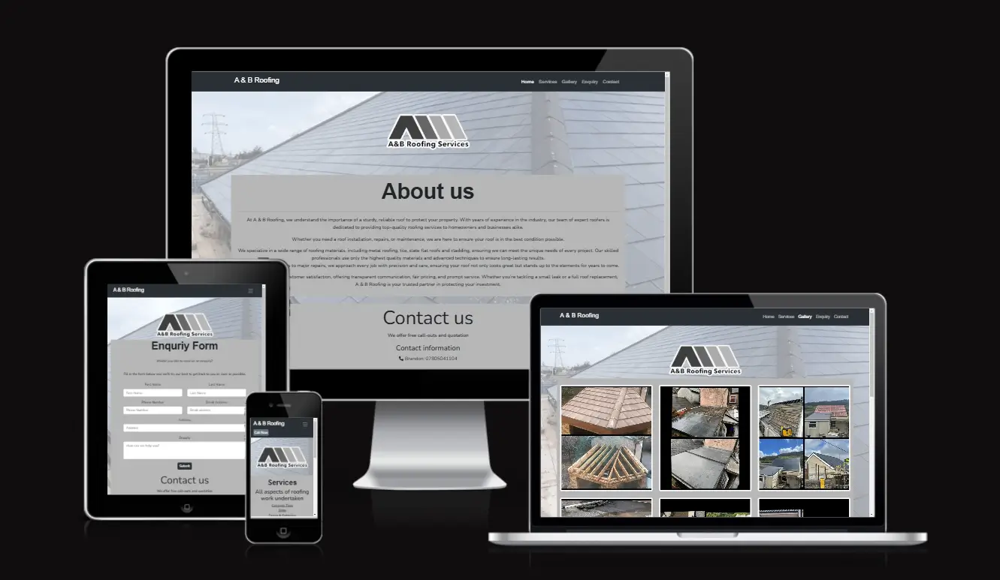

# My Milestone Project 1

## A & B Roofing Services Website
This is a real world business that is looking for a responsive and easy to use website for customers of all ages. This website will allow users to view previous completed jobs and see what the company offer in their services. Customers will have the ability to send an enquiry, use the click-to-call buttons at the very top and bottom of the page and visit the company's Facebook page.

[View A & B Roofing Services' page now!](https://chloejones9464.github.io/a-and-b-roofing-services/)

## Table Of Contents:
1. [Design & Planning](#design-&-planning)
    * [User Stories](#user-stories)
    * [Wireframes](#wireframes)
    * [Typography](#typography)
    * [Colour Scheme](#colour-scheme)

    
2. [Features](#features)
    * [Navigation](#navigation)
    * [Footer](#footer)
    * [Home page](#home-page)
    * [Other features](#other-features)

3. [Technologies Used](#technologies-used)
4. [Testing](#testing-links-and-responsiveness)
5. [Bugs](#bugs)
6. [Deployment](#deployment)
7. [Credits](#credits)

## Design & Planning:

### Initial Discussions
A & B Roofing Services is a company in the real world that have been established since COVID came around. It is a family run business with over 30 years experience and have proven very popular and reliable in and around the Rhondda Valleys.
Customers have spread the word about A & B Roofing Services through general word of mouth but the company have been looking to create another ways to reach their customers.

Along with Facebook and the local business magazine promotions, Brandon and Anthony have some concerns that these methods may not be enough. After a few customers asking if the business had another way to contact them and view their work, the company finally decided to create their own website with easy to use features. Features such as; the ability to call the company on any page, access to their ever growing portfolio, a service page with all they can offer and an enquiry page.

### Key information for the site

* The company's commitment to provide the best work possible at a very reasonable price.
* Having more than one point of contact for convenient and easy user experience.
* Displaying previous work on the website that will give customers reassurance of a job well done.
* Simple design, not to overwhelm users.

### User Stories

#### User experience

* As a user, I would like the website to have a clear navigation area so that I can use get from page to page with ease.
* As a user, I would like there to be clear information on the home page so that I know immediately I'm visiting the correct site.
* As a user, I want the contact details to be accessible on all pages so that I can find them with just one click.
* As a user, I want to have the option to contact the company through their website so that I have more than one option to get hold of the company.
* As a user, I want to have reassurance that enquiry has been sent so that I know the company has received it.

#### Company goals

* As the company owner, I want my website to have as much information as possible so that potential customers can see what services we have to offer.
* As the company owner, I would like to include various jobs we've completed on the website so that customers can view what we can do and to the standard we're proud of.
* As the company owner, I want to have a Call Now button for an emergency or ease of contact so that the customer can be redirected to the phone call right-away.

### Wireframes
I've created wireframes for multiple devices using Balsamiq Wireframes. These screen shots show the responsiveness I wanted to achieve in this project.

To view the wireframes for this project, please click [here](wireframes.md)
### Typography
I used Google Fonts to import fonts to use for the website.

I went with a combination on Nunito and Sans-Serif. Discussed with the company, these fonts seem very approachable, easy and friendly to the eye.
### Colour Scheme
As this is a project for an actual company, I've stuck with the color scheme given to me by their logo. Very minimalistic but effective.

I also tested these colors on the Contrast Grid website, this helped me decide where to use the colors best on different backgrounds. This website was recommended to me by Matt.

## Features:
Explain your features on the website,(navigation, pages, links, forms.....)
The website has a collapsable navigation bar in the header and a contact section in the footer, this was tested on all devices through DevTools and mobile devices (more below).
Each page on the website contains the company's logo at the very top of the page, this is for the effect and feel of consistency throughout the site.
### Pages on the website consist of a; 
* [Homepage (desktop)](documentation/home-feature.png) [Homepage (mobile)](documentation/home-mobile-feature.png) - The home page of the website contains the company's about us section where they express their dedication and commitment to deliver high quality roofing services. 
* [Services page (desktop)](documentation/services-feature.png) [Services page (mobile)](documentation/services-mobile-feature.png) - This is where the public and potential customers come to find out what the company has to offer and work they carry out. It contains a list of the works, this includes [clickable text for desktop](documentation/services-modal-feature.png) and for [mobile](documentation/services-modal-mobile-feature.png)  for the users to visually see the jobs undertaken under that name. There is also an image carousel displaying various completed jobs.
* [Gallery page (desktop)](documentation/gallery-feature.png) [Gallery page (mobile)](documentation/gallery-mobile-feature.png) - The company specifically asked for a page where they can display a range of jobs they have completed, mainly before and after images. Users can view the range and quality of work done by the business. The page also contains a video taken from a large job the company had completed recently.
* [Enquiry (desktop)](documentation/enquiry-feature.png) & [Thank you (desktop)](documentation/thank-you-feature.png) page,  [Enquiry (mobile)](documentation/enquiry-mobile-feature.png) & [Thank you(mobile)](documentation/thank-you-mobile-feature.png) page- The enquiry page is for the users to input their enquiry and send to the company out of the working hours. Once sending off the enquiry (after filling in each box) the user will be greeted with a thank you page, an acknowledgment that their form has been sent to the company.
* Contact - This remains at the bottom of every page.
[Home (desktop)](documentation/home-contact.png),
[Services (desktop)](documentation/services-contact.png),
[Gallery (desktop)](documentation/gallery-contact.png),
[Enquiry (desktop)](documentation/enquiry-contact.png),
[Thank you (desktop)](documentation/thank-you-contact.png),
[Home (mobile)](documentation/home-contact-mobile-feature.png),
[Services (mobile)](documentation/services-contact-mobile-feature.png),
[Gallery (mobile)](documentation/gallery-contact-mobile-feature.png),
[Enquiry (mobile)](documentation/enquiry-contact-mobile-feature.png),
[Thank you (mobile)](documentation/thank-you-contact-mobile-feature.png),

### Navigation
Within the navigation section of the site, there are 7 clickable links.
* The company's logo will take you directly to the home page, as will the Home link on the right hand side of the site.
* Services.
* Gallery.
* Enquiry
* Contact will take you to the bottom of each page to the Contact Us section.
* Call Now. This button in the navigation will appear only on phone devices and once clicked on, will give the user the ability to call the company immediately.

The navigation bar has a collapsable feature for smaller devices and will drop down when clicked on. After clicking the desired page, the menu will collapse.
### Footer
The footer contains the company's contact section. The section has links to the company's Facebook page and when on mobile devices, the ability to click on the contact numbers to call the company immediately.
## Technologies Used
For this project I used a number of technologies such as;
HTML
CSS
Bootstrap
Github
## Testing links and responsiveness
I've created screen recordings of myself testing the links and responsiveness of each page on the website. I feel that recording the screen was a new and exciting way of showcasing the responsiveness of the website, live in action.

Please click on this [link](testing-links-responsiveness.md) to see the videos and how the website responds!

### Google's Lighthouse Performance
I've tested each page for its performance, accessibility and best practices with Google Lighthouse. 

I've noticed that there are a few bugs on the Gallery page due to the YouTube video. It seems that Google break a few of their own rules!

Click [here](lighthouse.md) for screenshots of the website performance.

### Browser Compatibility
Testing the website on different browsers using the chrome extention 'User-Agent Switcher for Chrome'.
These are the browsers being tested(below) and each browser showed that the website was compatible.

### Code Validation
To validate my code, I used W3C Validation Service, this helped pick up any errors and warnings. I had a few small errors on most of the pages. One in particular would be that I had created a section on the page for the company logo. The website advised me to change the secion to a div if it doesnot require a heading of some sort.

Click [here](validation.md) to view all code validations.
### Manual Testing user stories or/and features
Test all your user stories, you an create table 
User Story |  Test | Pass
--- | --- | :---:
Clear information on front page | Test the contrast using WAVE [Screenshot of contrast testing](documentation/contrast-test.webp) | &check;
Navigation | Click navbar links on each page
-- | Home page - Services, Gallery, Enquiry, Contact and Call Now button | &check;
-- | Services page - Home page, Gallery, Enquiry, Contact and Call Now button | &check; 
-- | Gallery page - Home page, Services, Enquiry, Contact and Call Now button | &check;
-- | Enquiry page - Home page, Services, Contact and Call Now button | &check;
-- | Thank you page - Home page, Services, Enquiry, Contact and Call Now button | &check;
Contact details | Click contact links on each page (Home, Services, Enquiry, Gallery and Thank you)
-- | Call Now button in nav bar | &check;
-- | Contact number for Brandon in nav bar | &check;
-- | Contact number for Anthony in nav bar | &check;
-- | Facebook link in nav bar | &check;
Services page | Responsiveness of the images on the page including the modals on different devices, check the indicators on carousel | &check;
More content on Home and Services page | Create a small section with company description, test with family and friend on their devices | &check;
Gallery page | Images of before and after jobs by the company | &check;
Call Now button for mobiles | Test button and ensured it applies only to mobiles | &check;
Enquiry page | Test that each box must be filled to send form | &check;
Thank you page | Small thank you message and button back to the home page | &check;

**Please click [here](#testing-links-and-responsiveness) to see the testing of the pages.

## Bugs
### Company logo 
The logo would cause the layout on each page to change when the pixels went below 340px. this was solved (with the help from my mentor Matt) by adding a max hidth and height to it in the CSS stylesheet.

### Navigation
The collapsed navigation, at 320px, would position itself under the company's name in the header. I was able to correct this by giving the Call Now and Nav button a specific order in a media query.

### Modals
The modal each had an id attached to them which was picked up by the validation checks. I had changes the id to a class attribute to clear this error.

### Images
The images had taken up most of my time on this project as i had not correctly sized them for the website. I asked for help of my mentor and tutor to walk me through what I could do to better my practice. The tutor had suggested me to resixe the images in paint and convert them all to WEBP to achieve the best score on the Lighthouse text.

### Enquiry page
The form on the enquiry page was originally set a triangle layout when the page had reach the desktop width. My mentor made a very valid point in that people are not used to form displaying as a triangle. He suggested that I change the layout to a box as this is usually what people would expect.

### Interesting Bugs
* The iframe on the Gallery contains violations in the code YouTube provided for me to use the video on  my site. It showed picture in picture and autoplay which I'd amended. Google where breaking their own rules causing the webpage to flag up a few errors.
* Upon testing my responsiveness, my screen was showing that my website's responsiveness was working the way I'd like (down to 320px) but my mentor Matt tested this on his computer and it was showing the responsiveness I wanted was breaking at 324px.

## Deployment

#### Deloying on Github
The site was deployed to Github Pages using the following method:
- Go to the Github repository.
- Navigate to the 'settings' tab.
- Using the 'select branch' dropdown menu, choose 'main'.
- Click 'save'.

## Credits
List of used resources for your website (text, images, snippets of code, projects....)
  - Code & Text Content
 * Code Institute (ci-full-template)
 * Bootstrap - I used bootstraps software to achieve most of the features on the site.
 * Google fonts - This was used for the majority of the fonts across the website.
 * Font Awesome - For the contact information, I placed the call and facebook icon using this website.
 * Favicon.io - I created the favicon for the company's logo so that it will appear at in the tab when navigating through the pages.
 * support.google.com - I've asked questions through the google search engine to help rectify my lighthouse errors(image sizing).
 * coolors.co - This and the below website came in handy for when i was trying to get the perfect contrast for the website.
 * Color grid - as above
 * Am I Responsive? - I was able to find one error in my responsiveness using this site. The mobile device navbar was not showing the collapsable bar on the right hand side. It was showing it below the company's name. I was able to correct this to achieve the final appearence in the project image above.
 * TinyPNG - I used this website to cut the sixe of my images and change them to webp documents. Webp helped my site to performe much better with it's smaller size.
 * stackoverflow.com - I searched through this website's forums to find the best response to better improve my project such as using divs and sections correctly.
 * w3schools.com - Using this website helped me find codes that would help my website become more responsive.
 * YouTube - Thi site was used to show the company's video of a full slate roof.
 * chatGPT - I asked chat GPT to help create a description about a roofing company and what they provide.
 * validator.w3.org
 * jigsaw.w3.org/css-validator
 * geeksforgeeks.org - Used this for the same reasons as w3schools.com.

  - Media
* All roofing images and logo provided by the company.
  
  - Acknowledgment
    - acknowledgment to mentors, peers, tutors, friends, family, facilitator (who ever contributed and helped with the project)
* A huge thank you to my husband for helping with my first project by asking to provide a website for his company, and also helping around the house!
* Another big thank you to Matt Boden, my mentor, he's put up with some 'tricky for me but simple for him' questions which I'm ever so grateful for.
* Thomas from the tutoring session I requested. He helped me find an easier way to resize images to suit the website.
