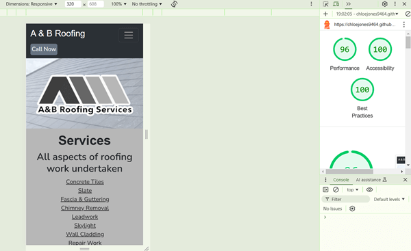
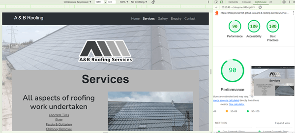

# Google's Lighthouse Performance
#### Mobile devices
##### Home page

##### Services page

##### Gallery page
This is the Lighthouse score without the video added to the site.

This is the score with the video now on the site.

##### Enquiry page

##### Thank you page

#### Desktop
##### Home page

##### Services page

##### Gallery page
This is the Lighthouse score without the video added to the site.

This is the score with the video now on the site.

This is the score and the errors pulled up on the page.

##### Enquiry page

##### Thank you page

[Home](README.md#googles-lighthouse-performance)